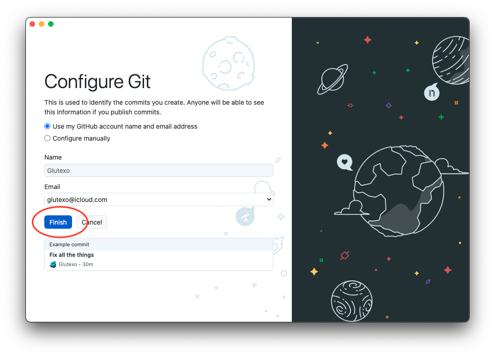

# Jak vystavit projekt na GitHubu GitHub Desktopem #

_GitHub Desktop_ je aplikace přímo od GitHubu zjednodušující práci s GitHubem a potažmo Gitem. Nepotřebuje žádné nastavování a umožňuje snadno odesílat kód do GitHubu bez nutnosti používat příkazovou řádku.

## Instalace ##

Stáhněte si _GitHub Desktop_ ze stránky [desktop.github.com](https://desktop.github.com).


Pokud máte v počítači [Homebrew](https://brew.sh/), můžete jej nainstalovat příkazem

```sh
$ brew install github
```

## První spuštění ##

Povolte na GitHubu přístup klepnutím na přihlašovací tlačítko. To otevře stránku, na které můžete udělit aplikaci oprávnění ke správě vašich repozitářů na GitHubu.


Pro jednoduchost aplikaci nechte použít nastavení z GitHubu.



_Je možné, že se vás aplikace bude snažit různými vyskakovacími okénky navést k prohlídce jejích možností. Nenechte se tím vyděsit a buď si aplikaci poctivě projděte, nebo všechna tato upozornění pozavírejte._

## Vytvoření repozitáře ##

Převeďte svůj projekt na gitový repozitář tlačítkem na úvodní obrazovce. Jako cestu uveďte nadřazenou složku, ve které máte složku se svým projektem, např. _/Users/Glutexo/Projekty_. Jako název projektu pak uveďte název složky se svým projektem, např. _hello-world_.


V levé části okna projektu zaškrtněte všechny soubory, které chcete vystavit. Zřejmě všechny kromě těch, které obsahují citlivé údaje jako např. hesla. Dole potom vyplňte popis (ten může být i tak jednoduchý jako „První verze“) a vytvořte nové „odevzdání“ neboli „commit“.


_Tímto jste vytvořili první uloženou verzi vašeho projektu, ke které se budete moct kdykoliv vrátit. Zatím však zůstává pouze na vašem počítači._

## Vystavení projektu ##

Tlačítkem v horní části okna nyní můžeme projekt vystavit.


Ověřte si jméno projektu a rozhodněte se, má-li být váš projekt dostupný široké veřejnosti. To je vše a projekt se po potvrzení nahraje na GitHub.


Svůj projekt si následně můžete otevřít v prohlížeči přímo na GitHubu.


## Hotovo ##


To je pro teď vše. S projektem lze dále dělat spoustu zajímavých věcí, ale už nyní si jej lze procházet internetovým prohlížečem. Pokud jste jej vystavili veřejně, může si jej kdokoliv stáhnout, zkoumat a svou kopii si upravovat.

_Tento návod jsem vystavil čistě GitHub Desktopem._
